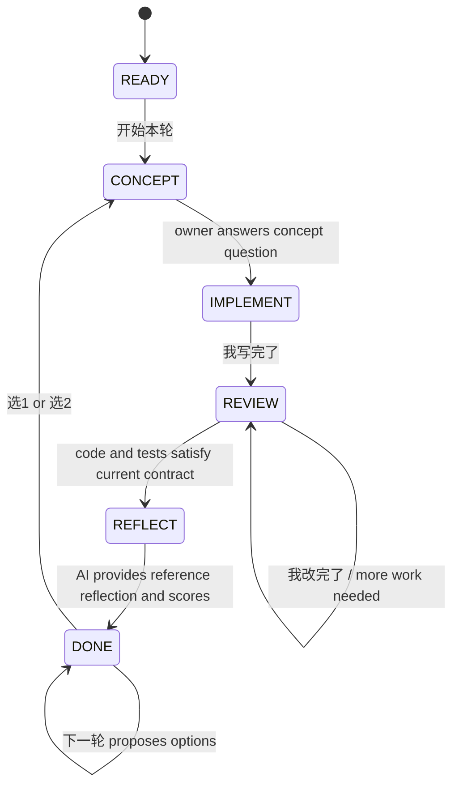

# Short-command mentor workflow

## Purpose

Use a small fixed command set to run the project as a persistent Agent-development course. The AI restores context from `docs/learning-journal.md`; the project owner does not need to repeat paths, boundaries, concepts, or scoring instructions.

## Commands

| Command | Meaning |
| --- | --- |
| `开始本轮` | Start or resume the current learning iteration |
| `提示 1` | Ask one guiding question only |
| `提示 2` | Point to the relevant input, condition, or test |
| `提示 3` | Provide short pseudocode without implementation |
| `提示 4` | Provide the smallest local code fragment, not a full rewrite |
| `我写完了` | Review the first owner-authored attempt and run relevant tests |
| `我改完了` | Re-review after the owner changes the implementation |
| `状态` | Show the current stage and next expected input |
| `下一轮` | Offer up to two next exercises after scoring |
| `选1` / `选2` | Select and start one proposed exercise |
| `暂停` | Save the current stage and stop |

Answer concept/design questions normally in your own words. After verified
code, the AI supplies the reference reflection answer directly; the owner does
not need to answer a final reflection question or send `继续`.

## Visible implementation contract

Before handing a human-owned function to the owner, show its concrete wiring
contract. Do not expect the owner to infer parameter sources from a signature
or reconstruct composition code from scattered tests.

Always include:

| Required item | What the mentor must show |
| --- | --- |
| Input parameters | name, type/data shape, one small example, and where the value comes from |
| Input use | which existing component consumes each value |
| Return value | exact shape and which caller consumes it |
| Existing components | functions/classes to call, with file locations |
| Ownership boundary | the few lines/decision the owner writes and what must not be reimplemented |
| Data flow | one ordered line from inputs through existing components to output |

For a composition function, explicitly distinguish injected dependencies from
objects created inside the function. State whether a parameter is a real or
fake implementation at runtime, and explain how the same function accepts
both. If the owner asks how to handle an intermediate response that an existing
loop already owns, point out that ownership before giving syntax help.

## Workflow



### READY

Read the project scope and learning journal. Select one concept, declare code ownership, explain the concept briefly, ask one question, and stop.

### CONCEPT

Treat the owner's normal reply as the concept answer. Give concise feedback.
When the answer is sufficient for the current milestone, present the visible
implementation contract above, create only the agreed fixture, signature, and
failing test, update state to `IMPLEMENT`, and stop at the learning checkpoint.

### IMPLEMENT

Wait for the owner to write the human-owned core. Respond to `提示 N` without
advancing. If confusion comes from an unclear parameter or dependency, restate
its source, shape, consumer, and existing implementation before escalating the
hint level. Respond to `我写完了` by reading the attempt and running the
smallest relevant test.

### REVIEW

Report one important issue at a time. Do not rewrite the owner-owned core. If
changes are needed, wait for `我改完了`. When behavior and tests satisfy the
current contract, enter `REFLECT` and provide the reference explanation of the
Agent boundaries and what the test proves.

### REFLECT

Do not wait for an owner reply. Give the correct reflection answer: inputs and
outputs, legal/safety boundary, context or state transition, stop behavior,
what each test proves, and at least one claim it does not prove. Score the
milestone using evidence already observed during concept, implementation, and
review; missing owner explanation remains an evidence limitation but does not
block completion. Append the learning entry, set state to `DONE`, and offer no
implementation work.

### DONE

Wait for `下一轮`. Propose at most two exercises based on the recorded concept gap. Start the selected option when the owner sends `选1` or `选2`.

## Current starting command

```text
开始本轮
```
