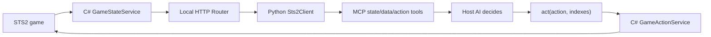

# Sources and architecture lessons

Research snapshot: 2026-07-16.

## STS2 wiki card data

Primary source: [Slay the Spire 2: Cards List](https://slaythespire.wiki.gg/wiki/Slay_the_Spire_2:Cards_List).

Use the wiki for version-sensitive card facts such as:

- stable card name or identifier when available;
- character or color;
- card type and rarity;
- energy cost;
- base and upgraded rules text;
- keywords needed by the current decision case.

Do not treat the wiki as a decision oracle. It describes cards but does not say which offered card is best for a particular deck, health total, route, relic set, or act.

### Fixture policy

Keep tests offline and deterministic:

1. Manually review a small set of wiki entries.
2. Store only the fields needed by the current test.
3. Add provenance beside the snapshot.
4. Write expected choices separately and label them as human-authored judgments.
5. Review fixtures after relevant game updates instead of silently refreshing them.

Use provenance shaped like:

```yaml
source_url: https://slaythespire.wiki.gg/wiki/Slay_the_Spire_2:Cards_List
retrieved_at: 2026-07-16
game_version: unknown
reviewed_by: human
```

Start with one character and roughly six to ten cards. Include enough variety to test attack, defense, synergy, upgrade, and skip behavior. Do not scrape or mirror the whole wiki for the first milestone. Confirm the site's current terms and content license before any later bulk ingestion.

The wiki rejected direct automated page opening with HTTP 403 during this research pass, although its indexed page content was discoverable. Treat ingestion reliability as unresolved; do not design the MVP around live access.

## `CharTyr-STS2-Agent` reference repository

Read-only location: `/Users/logan/PycharmProjects/CharTyr-STS2-Agent`.

### CodeGraph status

The repository contains an initialized `.codegraph/` index. The analysis below was refreshed with `codegraph explore` on 2026-07-16 using symbol and end-to-end flow queries for state construction, legal actions, map choices, card rewards, MCP tools, metadata lookup, and planner/combat handoff.

Refresh the analysis after material changes with a query similar to:

```bash
codegraph explore "Trace game state, legal actions, card rewards, map choices, MCP tools, and the decision handoff end to end."
```

CodeGraph reported no direct covering tests for several central symbols, including `BuildMapPayload`, `BuildRewardPayload`, `GetAvailableMapNodes`, `GetCardRewardOptions`, `ExecuteChooseMapNodeAsync`, and `ExecuteChooseRewardCardAsync`. The reference repository has broader validation scripts, but this gap reinforces the value of testing our first decision policy as a small pure function.

### Runtime architecture



### CodeGraph-verified call paths

Current symbol locations are recorded as a dated research snapshot, not a permanent API contract.

State observation:

```text
MCP get_game_state (server.py:540)
  -> _agent_state (server.py:441)
  -> Sts2Client.get_state
  -> GET /state handled by Router.HandleAsync (Router.cs:20)
  -> GameStateService.BuildStatePayload (GameStateService.cs:61)
  -> BuildAvailableActionNames (GameStateService.cs:1968)
  -> BuildMapPayload (GameStateService.cs:3474)
  -> BuildRewardPayload (GameStateService.cs:3881)
```

Legal-action observation:

```text
MCP get_available_actions (server.py:550)
  -> Sts2Client.get_available_actions
  -> GET /actions/available handled by Router.HandleAsync (Router.cs:20)
  -> GameStateService.BuildAvailableActionsPayload (GameStateService.cs:177)
```

Action execution:

```text
MCP act (server.py:755)
  -> Sts2Client.execute_action (client.py:627)
  -> POST /action handled by Router.HandleAsync (Router.cs:20)
  -> GameActionService.ExecuteAsync (GameActionService.cs:92)
  -> ExecuteChooseMapNodeAsync (GameActionService.cs:825)
     or ExecuteChooseRewardCardAsync (GameActionService.cs:1257)
     or ExecuteSkipRewardCardsAsync (GameActionService.cs:1306)
  -> wait for the relevant UI transition
  -> GameStateService.BuildStatePayload
  -> return ActionResponsePayload.state
```

The action dispatcher validates the current screen and action-specific preconditions again before clicking a UI option. It does not rely solely on the earlier `available_actions` snapshot. This gives two useful safety boundaries: advertise legal actions during observation, then validate legality again during execution.

`BuildMapPayload` constructs two different views from the same live map:

- `nodes` comes from all map points and preserves graph topology for route planning;
- `available_nodes` comes only from enabled visible nodes, assigns current option indexes, and constrains the next executable step.

`BuildRewardPayload` also models two distinct screens:

- the reward screen exposes claimable rewards;
- the card-reward overlay sets `pending_card_choice = true` and exposes indexed card options plus alternatives such as skip.

Choosing or skipping a card waits for a reward transition and returns a newly built state. Skipping records a special flag because dismissing the card overlay does not necessarily consume the underlying reward.

The optional planner/combat MCP tools call `Sts2HandoffService` with the latest state and package role-specific context. They do not implement card scoring or route scoring. CodeGraph found no policy symbol in these call paths that ranks offered cards or map branches; the host AI remains the strategic decision-maker.

Important files:

- `STS2AIAgent/ModEntry.cs`: initializes the game thread, event service, and HTTP server.
- `STS2AIAgent/Game/GameStateService.cs`: converts live game state into structured state, `agent_view`, and `available_actions`; `BuildMapPayload` and `BuildRewardPayload` define the two decision inputs most relevant here.
- `STS2AIAgent/Game/GameActionService.cs`: validates and dispatches requested actions, waits for transition stability, then returns freshly constructed state.
- `STS2AIAgent/Server/Router.cs`: exposes health, state, legal actions, metadata, events, and action endpoints.
- `mcp_server/src/sts2_mcp/client.py`: wraps the Mod HTTP API.
- `mcp_server/src/sts2_mcp/server.py`: exposes compact MCP tools such as `get_game_state`, `get_available_actions`, metadata lookup, and `act`.
- `mcp_server/src/sts2_mcp/handoff.py`: optionally separates non-combat planner context from combat context.
- `skills/sts2-mcp-player/SKILL.md`: defines the state-first operating discipline.

The repository is primarily a game adapter and action surface. CodeGraph confirms that the host AI still makes the strategic choice; there is no single card-ranking or route-ranking engine to copy.

### Ideas to adopt early

1. Separate observation from action execution.
2. Expose legal actions explicitly instead of letting the policy invent them.
3. Use stable internal IDs for matching and display text for explanations.
4. Treat live state as authoritative for legality and static metadata as authoritative for coarse semantics.
5. Re-read state after every external action and recalculate option indexes.
6. Represent a map with the full graph for planning and a smaller list of currently reachable nodes for execution.
7. Model card reward flow as `open reward -> choose or skip -> observe again`; skipping an overlay may not consume the underlying reward.
8. Validate legality both when enumerating actions and again immediately before executing one.

### Complexity to defer

| Reference capability | Why defer it |
| --- | --- |
| C# game Mod and reflection | It teaches integration before the decision model is understood. |
| HTTP and MCP layers | Manual objects are sufficient for the first policy and evaluation loop. |
| SSE and polling fallback | They solve live synchronization, not card-choice reasoning. |
| Planner/combat handoff | It adds context transfer and multiple roles before one policy is evaluated. |
| Persistent knowledge logs | Start with explicit fixtures and a small evaluation set. |
| Full card/relic/enemy databases | Load only facts required by current cases. |
| Multiplayer and all game screens | Card rewards and map choices already provide two independent learning domains. |

Borrow contracts and failure lessons from the reference repository. Do not transplant its architecture wholesale.
